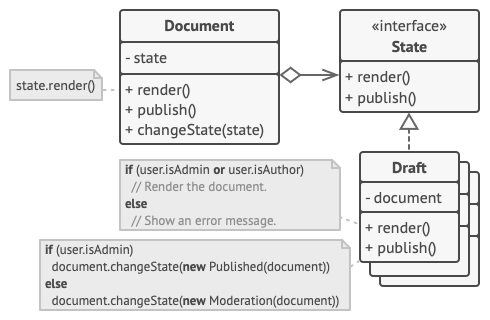

# State Design Pattern

## Definition

State is a behavioral design pattern that lets an object alter its behavior when its internal state changes. It appears as if the object changed its class.

## Example
### MP3 player

Depending on the current state of the player (locked, unlocked/ready, playing) the behaviour of 
the player will respond in a different way when clicking on the buttons.

## Other

- Example is from awesome website [Refactoring Guru](https://refactoring.guru)